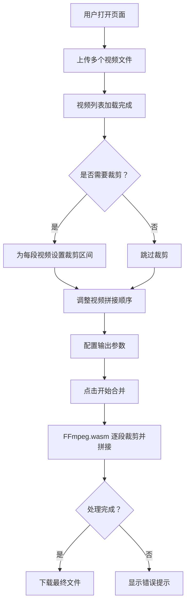

## 1. 产品概述

在线简易视频拼接器是一款基于浏览器的纯前端视频编辑工具，利用 FFmpeg.wasm 实现无需后端服务的视频裁剪与拼接能力。目标用户为需要快速合并多段视频的普通用户和内容创作者，解决传统视频编辑软件安装繁琐、操作复杂的问题。

## 2. 核心功能

### 2.1 用户角色

无需角色区分，所有访问者均为普通用户，直接使用全部功能。

### 2.2 功能模块

1. **视频拼接工作台**：视频上传列表、裁剪区间设置、顺序拖拽调整、输出参数配置、合并下载——单页面完成全部操作

### 2.3 页面详情

| 页面名称 | 模块名称 | 功能描述 |
|---------|---------|---------|
| 视频拼接工作台 | 视频上传区 | 支持拖拽或点击上传多个 MP4/WebM 视频文件，实时显示上传进度与文件信息 |
| 视频拼接工作台 | 视频列表区 | 以卡片列表展示已上传视频，包含缩略图、文件名、时长，以及裁剪区间输入（开始/结束时间）与预览按钮 |
| 视频拼接工作台 | 顺序调整区 | 支持拖拽排序和上下移动按钮调整视频段在最终输出中的先后顺序 |
| 视频拼接工作台 | 输出配置区 | 选择输出格式（默认 MP4）、画质预设（低/中/高）、是否保留音频 |
| 视频拼接工作台 | 合并下载区 | 显示处理进度条，提供"开始合并"按钮与"下载文件"按钮 |

## 3. 核心流程

用户打开页面 → 上传多个视频文件 → 为每段视频设置裁剪区间（可选）→ 调整拼接顺序 → 配置输出参数 → 点击合并 → FFmpeg.wasm 在浏览器中处理 → 下载最终文件

## 4. 用户界面设计

### 4.1 设计风格

- **主色调**：深色背景（#0f0f13）配合亮橙色强调色（#ff6b2b），营造专业视频编辑工具氛围
- **辅助色**：暗灰色卡片（#1a1a24）、中灰色边框（#2a2a3a）、白色文字
- **按钮风格**：圆角矩形，主按钮亮橙色填充，次要按钮灰色描边
- **字体**：标题使用 Outfit（几何感现代字体），正文使用 DM Sans
- **布局风格**：单栏居中布局，顶部标题栏，主体分为左右两栏（视频列表 + 配置面板）
- **图标风格**：线性图标，配合 Lucide Icons

### 4.2 页面设计概览

| 页面名称 | 模块名称 | UI 元素 |
|---------|---------|---------|
| 视频拼接工作台 | 顶部标题栏 | Logo + 应用名称，深色背景，亮橙色品牌色点缀 |
| 视频拼接工作台 | 视频上传区 | 虚线边框拖拽区域，上传图标，支持提示文字，hover 时边框变亮橙色 |
| 视频拼接工作台 | 视频卡片 | 缩略图 + 文件名 + 时长 + 裁剪时间输入框 + 预览播放按钮 + 删除按钮 + 拖拽手柄 + 上下移动按钮 |
| 视频拼接工作台 | 输出配置面板 | 格式下拉选择、画质预设单选组、音频开关，卡片式布局 |
| 视频拼接工作台 | 合并下载区 | 大号主按钮"开始合并"，进度条（带百分比），下载按钮 |

### 4.3 响应式设计

- 桌面端优先设计，双栏布局（左：视频列表，右：配置面板）
- 平板端：单栏布局，配置面板移至列表下方
- 移动端：紧凑单栏，卡片堆叠，触摸优化拖拽

### 4.4 3D 场景指引

不适用
