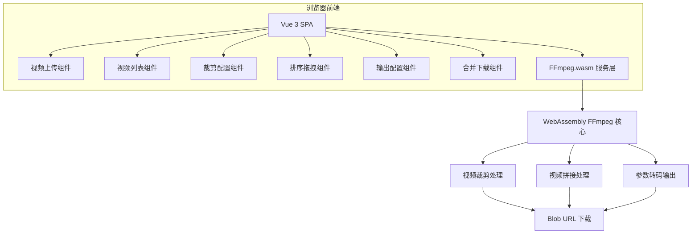
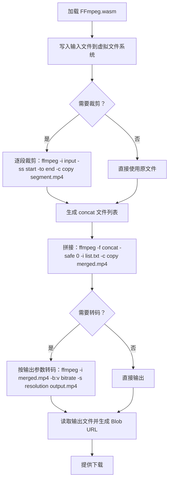

## 1. 架构设计



纯前端架构，无后端服务。所有视频处理在浏览器中通过 FFmpeg.wasm 完成。

## 2. 技术说明

- **前端框架**：Vue 3（Composition API + `<script setup>`）
- **构建工具**：Vite
- **语言**：TypeScript
- **视频处理核心**：FFmpeg.wasm（@ffmpeg/ffmpeg + @ffmpeg/util）
- **拖拽排序**：vuedraggable（基于 SortableJS 的 Vue 3 封装）
- **样式方案**：原生 CSS + CSS Variables（不引入 UI 框架，保持轻量）
- **图标**：Lucide Icons（@lucide/vue-next）
- **初始化工具**：create-vue

## 3. 路由定义

单页应用，无需路由。所有功能在一个页面中完成。

| 路径 | 用途 |
|-----|------|
| / | 视频拼接工作台（唯一页面） |

## 4. API 定义

无后端 API。以下为前端核心类型定义：

```typescript
interface VideoItem {
  id: string
  file: File
  name: string
  duration: number
  thumbnailUrl: string
  objectUrl: string
  trimStart: number
  trimEnd: number
  isProcessing: boolean
}

interface OutputConfig {
  format: 'mp4' | 'webm'
  quality: 'low' | 'medium' | 'high'
  keepAudio: boolean
}

type QualityPreset = {
  low: { bitrate: string; resolution: string }
  medium: { bitrate: string; resolution: string }
  high: { bitrate: string; resolution: string }
}
```

## 5. 服务器架构图

不适用（纯前端应用）

## 6. 数据模型

不适用（无持久化数据，所有数据存在于组件状态中）

## 7. FFmpeg.wasm 处理流程


